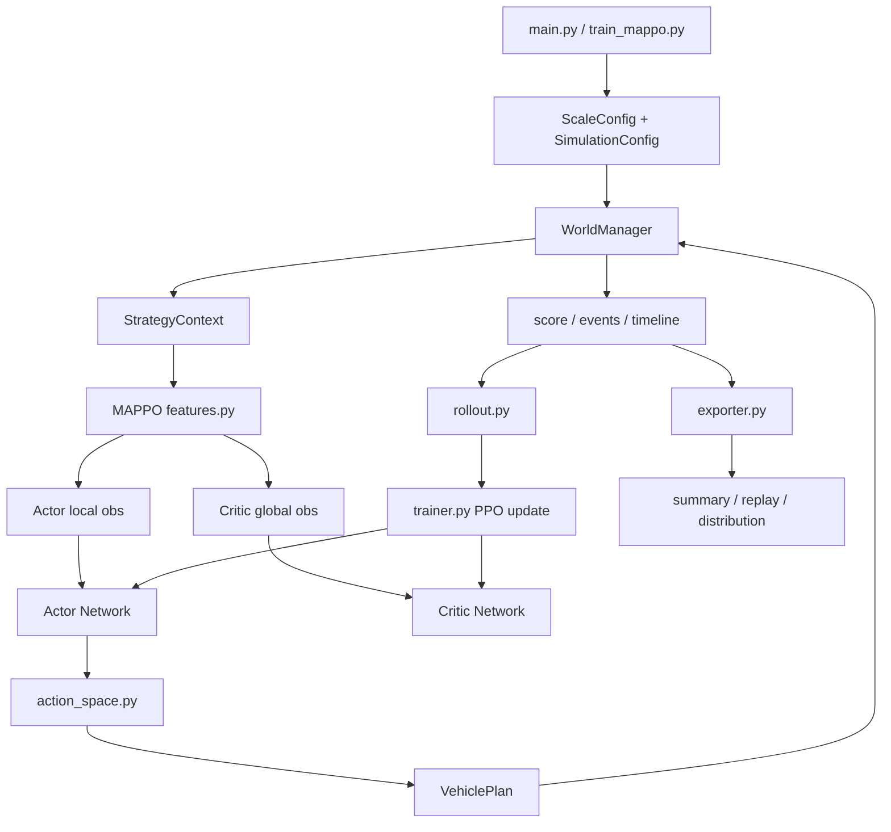

# MAPPO 多车协同调度架构搭建说明

### 应对多车协同：MAPPO (多智能体 PPO)

如果你的系统里不仅有一辆车，而是一个车队，单体 PPO 就会很吃力，因为它把所有车当成一个“超级大脑”来控制，动作空间会呈指数级爆炸。

* **先进之处：** MAPPO 采用了 **CTDE (集中式训练，分布式执行)** 架构。
* **工作原理：** 在仿真器里，Critic 网络可以看到全局的交通、所有车的电量，它负责统筹和打分；但是每个具体的 Actor（单辆物流车）只根据自己局部的视野（比如周围几个街区的拥堵、自己车上的包裹）来做决策。
* **优势：** 极大地降低了训练难度，每辆车只需要运行一个很小的推理模型。

## 1. 总体目标

基于当前代码，将 MAPPO 作为一个新的“学习型调度策略”接入现有仿真系统。

现有系统的核心边界保持不变：

```text
配置/路网/任务生成
        ↓
WorldManager 推进真实仿真状态
        ↓
SchedulingStrategy 输出 VehiclePlan
        ↓
WorldManager 执行路径、装卸、充电、计分
        ↓
Exporter 输出 replay / summary / distribution
```

MAPPO 只替换“策略如何生成 `VehiclePlan`”这一层，同时新增训练框架，让模型能从仿真反馈中学习。

## 2. 当前代码中的基础层

### 配置层

位置：`src/config.py`

保留现有：

- `ScaleConfig`：small / medium / large 的节点数、车辆数、任务数、horizon、seed。
- `SimulationConfig`：电量、载重、速度、装卸时间、奖励和惩罚参数。

MAPPO 新增配置建议放在 `src/mappo/config.py`：

- 观测参数：`top_k_tasks`、`top_k_stations`、`max_agents`。
- 训练参数：`gamma`、`gae_lambda`、`clip_ratio`、`entropy_coef`、`learning_rate`。
- 路径参数：checkpoint、日志目录、评估输出目录。

### 数据模型层

位置：`src/models.py`

继续复用现有模型：

- `Vehicle`
- `Task`
- `ChargingStation`
- `VehicleState`
- `TaskStatus`

MAPPO 不直接修改这些实体，只读取它们构造观测，并通过 `VehiclePlan` 影响世界。

### 仿真执行层

位置：`src/world.py`

`WorldManager` 仍然是唯一真实状态拥有者，负责：

- 生成任务。
- 推进车辆移动。
- 执行装货、卸货、充电。
- 检查电量、安全约束、任务冲突。
- 计算奖励和保存 timeline。

为了训练 MAPPO，需要给 `WorldManager` 增加训练友好的公开接口：

- `reset_episode(scale, config, seed)`：创建一局仿真。
- `build_context()`：返回当前 `StrategyContext`。
- `step_with_plans(plans)`：接收外部生成的 `VehiclePlan`，推进一个 tick。
- `is_done()`：判断 horizon 结束或仿真失败。
- `episode_result()`：返回最终 `SimulationResult`。

现有 `run()` 可以继续保留，并内部复用这些方法。

## 3. MAPPO 新增模块

建议新增目录：

```text
src/mappo/
  config.py
  features.py
  action_space.py
  env_adapter.py
  networks.py
  rollout.py
  trainer.py
  checkpoint.py
  evaluator.py
```

### `features.py`

负责把 `StrategyContext` 转成神经网络输入。

每辆车 Actor 看到局部观测：

- 自车状态：位置、电量比例、载重比例、是否空闲、是否充电、是否载货。
- 局部任务：按紧急度和距离排序的前 `top_k_tasks` 个 pending 任务。
- 局部充电站：最近 `top_k_stations` 个站点的距离、排队压力、是否可达。
- 局部交通/全局摘要：当前 tick 比例、pending 数、超时数、车队平均电量。

Critic 看到全局观测：

- 所有车辆摘要。
- 所有任务状态统计。
- 所有充电站压力。
- 当前总分、tick、完成率、超时率。

输出：

```python
actor_obs: Tensor[vehicle_count, actor_obs_dim]
critic_obs: Tensor[critic_obs_dim]
action_mask: Tensor[vehicle_count, action_dim]
```

### `action_space.py`

定义 MAPPO 的离散宏动作。

建议第一版动作空间：

```text
0 keep
1 return_depot
2 charge_best
3 dispatch_task_0
4 dispatch_task_1
5 dispatch_task_2
6 dispatch_task_3
7 dispatch_task_4
```

动作含义：

- `keep`：不下发新计划。
- `return_depot`：空车回仓库。
- `charge_best`：去当前可达且综合代价最低的充电站。
- `dispatch_task_i`：选择局部观测里的第 i 个任务。

该模块还负责动作合法性 mask：

- 非空闲车辆只能 `keep`。
- 任务已完成、已分配、超载、不可达时屏蔽对应 dispatch 动作。
- 电量不足到达任何充电站时屏蔽 `charge_best`。
- 已在仓库且无任务压力时允许 `keep` 或补能。

### `env_adapter.py`

这是 MAPPO 和现有仿真器之间的桥。

职责：

- 创建 `WorldManager`。
- 每个 tick 调用 `features.py` 生成观测。
- 接收 Actor 输出的每辆车动作。
- 调用 `action_space.py` 把动作转成 `VehiclePlan`。
- 调用 `WorldManager.step_with_plans()` 推进世界。
- 计算训练奖励。

奖励建议：

```text
reward =
  score_delta
  - invalid_action_penalty
  - duplicate_task_penalty
  - pending_pressure_penalty
  - extra_distance_penalty
```

其中 `score_delta` 来自现有计分体系，保证训练目标和项目业务目标一致。

### `networks.py`

使用 PyTorch 实现网络。

Actor：

- 输入：单车局部观测。
- 输出：该车动作分布 logits。
- 所有车辆共享同一个 Actor 参数。

Critic：

- 输入：全局观测。
- 输出：当前全局状态价值 `V(s)`。

结构建议：

- MLP 两层隐藏层。
- hidden size 默认 128。
- 激活函数 ReLU。
- Actor 输出前应用 action mask，非法动作 logits 置为极小值。

### `rollout.py`

负责保存一批采样数据：

- actor_obs
- critic_obs
- actions
- log_probs
- rewards
- dones
- values
- action_masks

并计算：

- GAE advantage
- return
- PPO mini-batch

### `trainer.py`

训练主循环。

建议新增入口脚本：

```text
train_mappo.py
```

训练流程：

```text
for curriculum_stage in [small, medium, large]:
    for episode in stage_episodes:
        reset env
        while not done:
            build obs
            actor sample actions
            env step
            store rollout
        update actor/critic by PPO
        periodically evaluate
        save best checkpoint
```

课程训练默认：

- small：先学会基本派单、回仓、充电。
- medium：扩大车辆和任务规模。
- large：微调大规模协同能力。

### `checkpoint.py`

负责模型保存和加载。

输出目录：

```text
outputs/mappo/checkpoints/
  latest.pt
  best_small.pt
  best_medium.pt
  best_large.pt
  best.pt
```

checkpoint 内容：

- actor state dict
- critic state dict
- optimizer state
- MAPPO config
- 训练阶段、episode、评估指标

### `evaluator.py`

负责固定 seed 对比评估。

对比对象：

- `nearest_task`
- `max_weight`
- `time_first_bundle`
- `rl_charging`
- `hyper_selector`
- `mappo`
- 可选：`gurobi_static_optimal` 作为离线上界参考

输出：

```text
outputs/mappo/eval_summary.csv
outputs/mappo/eval_report.md
outputs/mappo/replay/*.json
```

## 4. 推理策略接入

新增：

```text
src/strategies/mappo_strategy.py
```

类名：

```python
class MAPPOSTrategy(SchedulingStrategy):
    name = "mappo"
```

职责：

- 加载训练好的 Actor checkpoint。
- 在 `build_plans(context)` 中构造每辆车局部观测。
- 使用 Actor 选择动作。
- 把动作转成 `VehiclePlan`。
- 返回给现有 `WorldManager` 执行。

注册位置：

- `src/strategies/__init__.py`
- `main.py::build_strategy_factories()`
- `argparse --strategy choices`

建议 `--strategy all` 暂不默认包含 `mappo`，除非指定 checkpoint 存在，避免未训练时报错。

新增参数：

```text
--mappo-checkpoint outputs/mappo/checkpoints/best.pt
--mappo-device cpu/cuda
--mappo-deterministic
```

## 5. 模块交互关系



## 6. 测试与验收

最小冒烟测试：

```powershell
python train_mappo.py --preset smoke --device cpu
python main.py --scale small --strategy mappo --rounds 1 --mappo-checkpoint outputs/mappo/checkpoints/best.pt
```

单元测试重点：

- 观测维度在 small / medium / large 下固定。
- 非法动作 mask 正确。
- 动作转 `VehiclePlan` 后不会产生重复任务占用。
- checkpoint 可保存、加载、推理。
- 原有策略结果不因 MAPPO 接入发生变化。

验收标准：

- MAPPO 能在 small 规模完整跑完，无仿真失败。
- replay 文件能被现有 `replay_ui` 打开。
- summary 字段与已有策略一致。
- 训练日志能看到平均得分或完成率随训练阶段改善。
- medium / large 至少能稳定推理，后续再追求超过启发式策略。

## 7. 实施顺序

1. 先改造 `WorldManager`，补齐训练所需的 step API。
2. 实现 `features.py` 和 `action_space.py`，先用随机动作做仿真闭环。
3. 实现 `MAPPOSTrategy`，支持加载一个随机初始化或假 checkpoint 做推理冒烟。
4. 实现 PyTorch Actor / Critic、rollout 和 PPO 更新。
5. 实现 `train_mappo.py`，先跑 smoke preset。
6. 加入 evaluator，与现有策略和 Gurobi 输出做统一对比。
7. 最后补文档、参数说明和实验结果表。

## 8. 默认假设

- MAPPO 第一版做“宏观调度决策”，不做逐边驾驶控制。
- 路径规划继续使用现有 `ShortestPathOracle`。
- 任务仍然从仓库装货并送达目的地。
- 充电、装卸、移动、电量消耗仍由 `WorldManager` 统一执行。
- 引入 PyTorch 和 numpy，新增依赖写入 `requirements-mappo.txt`。
- 不清理当前已有 `outputs/`、`__pycache__/` 或 Gurobi 结果文件。
