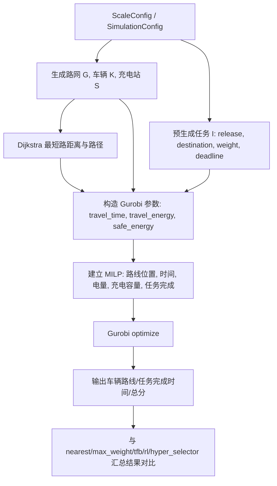

# 新能源物流车队调度 Gurobi 数学建模审阅稿

> 本文档先服务于审阅，不直接假定所有策略偏好都应成为 Gurobi 硬约束。项目中真实由 `WorldManager` 执行并会触发失败的规则，记为“硬约束”；策略文件中的优先级、权重、阈值，记为“启发式偏好”；建议进入 Gurobi 的静态上帝视角模型，记为“拟建模约束”。

## 0. 审阅结论先行

建议后续 Gurobi 模型定位为：已知一段 horizon 内所有任务的静态新能源车辆路径调度问题，即带释放时间、软截止时间、电量约束、充电站容量约束的 EVRPTW 变体。目标函数建议最大化项目现有总分：

```text
总分 = 完成收益 - 超时罚分 - 总里程罚分
```

已确认的建模口径：

- 任务允许不完成：未完成任务不给完成收益；若 deadline 已在 horizon 内经过，则只扣一次超时罚分。
- 任务允许晚完成：晚完成任务保留“双重惩罚”，即一次 timeout penalty 加 late completion negative reward。
- 允许部分充电：Gurobi 可选择充电时长/充电量，不强制充满。
- 充电站不能只建容量约束：需要体现 FIFO 排队/先来先服务语义。
- 目标函数做两个版本：版本 1 为项目总分最大化；版本 2 为多目标，先最大完成数，再最小超时数，再最大总分。
- large 规模不接受限时求解和 gap 作为最终最优证明：默认严格求最优，调试参数只作为临时运行工具。
- 每个版本做 5 次生成与求解：每次复用项目原本任务生成器一次性生成全任务序列，以全知视角求解；最终先列平均表现，再列每次详细结果。
- 是否保留“拼单重量和不得超过载重”：这是 `time_first_bundle` 的策略层限制，世界执行层实际是逐单回仓装货，不同时携带两单。Gurobi 只保留单任务重量不超过载重。

## 1. 项目已有约束清单

### 1.1 环境与数据生成约束

- 路网是无向加权图，节点有二维坐标，边权为距离。
- 仓库节点固定为 `depot_node = 0`。
- 图由抖动网格生成，主路连接局部邻居，少量对角线和跳格边，0 号仓库节点额外增强连接。
- 每个规模有固定节点数、车辆数、充电站数、horizon、任务数、随机种子。
- 充电站包含仓库站，非仓库充电站按空间分散原则选取。
- 任务在仿真开始前预生成，但只在 `release_time` 到达时释放给策略。
- 任务释放时间位于 `[0, 0.9H)`，分布可为 uniform 或 gaussian。
- 每个任务目的地不是仓库，目的节点从 `1..node_count-1` 抽样。
- 任务重量来自截断高斯，实际上界不超过最大车载重的 95%。
- 每个任务 deadline = release_time + 随机宽限时间，宽限时间在 `deadline_range` 内。

### 1.2 任务执行约束

- 每个任务从仓库装货，到任务目的节点卸货。
- 装货动作只能在仓库执行。
- 卸货动作在当前绑定任务的目的地执行。
- 任务状态流转为 `pending -> assigned -> in_progress -> completed`。
- 任务最多由一辆车占用，项目未实现多车协同拆分同一任务。
- 任务若已被别的车辆占用，再被分配会触发仿真失败。
- 任务若重量超过车辆载重，被分配会触发仿真失败。
- 策略只能看到已释放任务，即 `release_time <= tick` 且状态为 pending 的任务。

### 1.3 车辆运动与时间约束

- 仿真是离散 tick。
- 每个 tick 先推进世界，再调用策略。
- 车辆状态为 `idle/moving/loading/unloading/waiting_charge/charging`。
- 一辆车同一时刻只能处于一种状态。
- 装货耗时 `loading_duration` 个 tick。
- 卸货耗时 `unloading_duration` 个 tick。
- 车辆按最短路展开策略给出的关键节点链。
- 通过一条边的计划到达时间使用 `ceil(edge_distance / speed)`。
- 行驶时每 tick 推进 `speed` 距离，直到当前边走完。
- 空闲车辆若带有未完成任务链但路线缓存丢失，世界管理器会恢复当前任务执行计划。

### 1.4 电量与安全约束

- 车辆有电池容量上限 `battery_capacity`。
- 行驶单位距离耗电 `energy_per_distance`。
- 进入下一条边前必须满足：

```math
B_k \ge e_k d_{uv}
```

且到达下一节点后还必须有能力去仓库或最近充电站，并额外保留安全余量：

```math
B_k \ge e_k d_{uv}
      + \min \{ e_k D(v, depot),\ \min_{s \in S} e_k D(v, s) \}
      + reserve
```

项目中 `reserve = 2.0`。

### 1.5 充电站约束

- 充电动作只能在充电站节点执行。
- 每个充电站有 `piles` 个桩。
- 同一时刻站内正在充电车辆数不能超过桩数。
- 若桩满，车辆进入站点 FIFO 等待队列。
- 每 tick 充电量增加 `charge_rate`，不超过电池容量。
- 充满后车辆自动离桩进入 idle。
- 车辆在无载货、无进行中任务时，可以被策略从 charging/waiting_charge 中断并改派新任务。
- 站点压力指标为：

```math
pressure_s = \frac{|charging_s| + |queue_s|}{piles_s}
```

这是策略偏好与可视化指标，不是硬性可行性约束。

### 1.6 策略输出合法性约束

每辆车策略输出 `VehiclePlan(vehicle_id, task_id, action, planned_path)`。

- `len(action) == len(planned_path)`。
- `action` 只能是 `keep/load/unload/charge`。
- `planned_path` 是关键节点链，不是逐边路径。
- 世界管理器会把关键节点间的最短路展开成真实行驶路线。
- 非空闲车辆默认不接收新计划，只有 charging/waiting_charge 且新计划含任务时可以被改派。

### 1.7 评分目标

项目总分由三类主要项组成：

```math
Score = \sum_i reward_i - P^{timeout}\sum_i overdue_i - \alpha^{dist}\sum_k Dist_k
```

若触发仿真失败，还会额外扣 `200` 分。Gurobi 模型若把硬约束建全，应不需要 failure penalty。

单任务完成收益为分段函数。设任务 `i` 的释放时间为 `r_i`，截止时间为 `D_i`，完成时间为 `C_i`，允许时间窗为：

```math
A_i = \max(1, D_i - r_i)
```

若准时完成：

```math
reward_i =
R^{base}\left(0.4 + 0.6\left(1 - \frac{C_i-r_i}{A_i}\right)\right),
\quad C_i \le D_i
```

若晚完成：

```math
reward_i =
-\lambda^{late}\left(0.5 + \frac{C_i-D_i}{A_i}\right),
\quad C_i > D_i
```

超时罚分是一次性事件：只要任务在某个 tick 满足 `tick > deadline` 且尚未完成，就扣一次 `timeout_penalty`。因此晚完成任务会同时承担“超时罚分”和“晚完成负收益”。

### 1.8 策略层启发式偏好

这些不是世界硬约束，但用于解释现有算法。

- `nearest_task`：优先总路程短，其次 deadline 早，再其次重量大。
- `max_weight`：优先重量大，其次 deadline 早，再其次总路程短。
- `time_first_bundle`：先紧急任务，后两单拼单，最后空闲车充电再平衡。
- `RL_charging`：继承 TFB，用轻量 Q-learning 决定个体车辆是否充电。
- `hyper_selector`：继承 TFB，用双 Q 表按时间窗选择派单模式和充电模式。

## 2. 语义锚点

### 2.1 符号字典

| 符号 | 类型 | 量纲/维度 | 来源 | 含义 |
|---|---|---:|---|---|
| `G=(N,E)` | 输入 | 图结构 | `src/graph_utils.py` | 城市道路网络 |
| `N` | 输入集合 | 节点个数 | `ScaleConfig.node_count` | 路网节点集合 |
| `E` | 输入集合 | 边条数 | 图生成器 | 可直接通行道路集合 |
| `o` | 输入参数 | 节点编号 | `SimulationConfig.depot_node` | 中央仓库 |
| `S` | 输入集合 | 站点数 | `ScaleConfig.station_count` | 充电站集合 |
| `K` | 输入集合 | 车辆数 | `ScaleConfig.vehicle_count` | 车辆集合 |
| `I` | 输入集合 | 任务数 | `ScaleConfig.task_count` | 任务集合 |
| `H` | 输入参数 | tick | `ScaleConfig.horizon` | 仿真总时长 |
| `T={0,...,H-1}` | 派生集合 | tick | 由 `H` 派生 | 离散时间集合 |
| `d_{uv}` | 输入参数 | 距离 | 图边权或最短路 | 节点 `u` 到 `v` 的距离 |
| `\tau_{kuv}` | 派生参数 | tick | `ceil(d/speed)` | 车辆 `k` 从 `u` 到 `v` 的行驶时间 |
| `r_i` | 输入参数 | tick | 预生成任务 | 任务释放时间 |
| `D_i` | 输入参数 | tick | `release + deadline_offset` | 任务截止时间 |
| `g_i` | 输入参数 | 节点编号 | 预生成任务 | 任务目的节点 |
| `w_i` | 输入参数 | 货物重量 | 预生成任务 | 任务重量 |
| `Q_k` | 输入参数 | 货物重量 | 车辆配置 | 车辆载重上限 |
| `B_k^{max}` | 输入参数 | 能量 | 车辆配置 | 电池容量 |
| `B_{kp}` | 决策/状态变量 | 能量 | Gurobi | 车辆在路线位置 `p` 后的电量 |
| `e_k` | 输入参数 | 能量/距离 | 车辆配置 | 单位距离耗电 |
| `v_k` | 输入参数 | 距离/tick | 车辆配置 | 车辆速度 |
| `L` | 输入参数 | tick | `loading_duration` | 装货时长 |
| `U` | 输入参数 | tick | `unloading_duration` | 卸货时长 |
| `m_s` | 输入参数 | 车辆数 | 充电站配置 | 充电桩数量 |
| `c_s` | 输入参数 | 能量/tick | 充电站配置 | 充电速度 |
| `reserve` | 输入参数 | 能量 | 项目硬编码 `2.0` | 安全电量余量 |
| `R^{base}` | 输入参数 | 分数 | `completion_base_reward` | 完成基础奖励 |
| `\lambda^{late}` | 输入参数 | 分数 | `late_completion_penalty_factor` | 晚完成惩罚系数 |
| `P^{timeout}` | 输入参数 | 分数 | `timeout_penalty` | 超时一次性罚分 |
| `\alpha^{dist}` | 输入参数 | 分数/距离 | `distance_penalty_factor` | 里程扣分系数 |
| `M` | 派生参数 | 大常数 | 建模选择 | Big-M 线性化常数 |
| `x_{kpq}` | 决策变量 | 0/1 | Gurobi | 车辆 `k` 在路线位置 `p` 选择事件 `q` |
| `y_i` | 决策变量 | 0/1 | Gurobi | 任务 `i` 是否完成 |
| `y_i^{on}` | 决策变量 | 0/1 | Gurobi | 任务 `i` 是否准时完成 |
| `y_i^{late}` | 决策变量 | 0/1 | Gurobi | 任务 `i` 是否晚完成 |
| `O_i` | 决策变量 | 0/1 | Gurobi | 任务 `i` 是否触发超时罚分 |
| `C_i` | 决策变量 | tick | Gurobi | 任务完成时间 |
| `A_{kp}` | 决策变量 | tick | Gurobi | 车辆位置 `p` 事件开始时间 |
| `F_{kp}` | 决策变量 | tick | Gurobi | 车辆位置 `p` 事件结束时间 |
| `q_{kps}` | 决策变量 | tick 或能量 | Gurobi | 车辆 `k` 在位置 `p` 于站 `s` 的充电时长或充电量 |
| `z_{kpst}` | 决策变量 | 0/1 | Gurobi | 车辆 `k` 的充电事件是否占用站 `s` 的 tick `t` |

### 2.2 核心符号直觉比喻

- `G=(N,E)` 像城市地图，节点是路口，边是道路。
- `d_{uv}` 像两地之间的路程表。
- `\tau_{kuv}` 像导航软件估算的行驶用时。
- `r_i` 像订单进入系统的时间，没到这个时间前调度员虽然“上帝视角”知道它存在，但不能发车处理。
- `D_i` 像客户承诺送达时间。
- `w_i` 像包裹重量。
- `Q_k` 像车辆后备箱承重极限。
- `B_k^{max}` 像油箱容量。
- `B_{kp}` 像仪表盘上的剩余电量。
- `reserve` 像司机必须保留的“回安全区底油”。
- `m_s` 像充电站的停车位数量。
- `c_s` 像充电枪功率。
- `y_i` 像订单是否被签收的开关。
- `C_i` 像签收时间戳。
- `O_i` 像系统是否给该订单盖了“超时扣分”章。
- `\alpha^{dist}` 像每公里运营成本。
- `x_{kpq}` 像车辆路线清单中第 `p` 格写下的下一件事。
- `z_{kpst}` 像充电站每个时间格子的车位占用表。

## 3. 逻辑分层

### 3.1 总目标函数拆解

建议 Gurobi 最大化：

```math
\max\ Score =
\underbrace{\sum_{i \in I} reward_i}_{完成收益}
- \underbrace{P^{timeout}\sum_{i \in I} O_i}_{超时一次罚分}
- \underbrace{\alpha^{dist}\sum_{k \in K} Dist_k}_{总里程成本}
```

逻辑块解释：

- 完成收益：鼓励尽量多完成任务，并且越早完成越好。
- 超时一次罚分：模拟项目中 deadline 之后仍未完成的即时扣分。
- 总里程成本：防止模型为了抢少量时间而绕远路。

### 3.2 单任务完成收益拆解

准时完成部分：

```math
reward_i^{on}
= R^{base}\left(0.4 + 0.6\left(1-\frac{C_i-r_i}{A_i}\right)\right)
```

- `0.4` 是保底准时收益，哪怕卡着 deadline 完成也有 `40%` 基础奖励。
- `0.6(1 - elapsed/allowed)` 是早完成奖励斜坡，越早越接近满分。

晚完成部分：

```math
reward_i^{late}
= -\lambda^{late}\left(0.5 + \frac{C_i-D_i}{A_i}\right)
```

- `0.5` 是晚完成固定负反馈。
- `(C_i-D_i)/A_i` 是迟到程度，迟到越久扣得越多。

### 3.3 路线事件拆解

由于项目中所有任务都从仓库装货，建议把“执行任务 i”抽象成一个复合事件：

```text
当前位置 -> 仓库 -> 装货 L tick -> 任务目的地 g_i -> 卸货 U tick
```

该事件的时间消耗：

```math
time(prev,i)
= \tau(prev,o) + L + \tau(o,g_i) + U
```

该事件的行驶距离：

```math
dist(prev,i)
= D(prev,o) + D(o,g_i)
```

该事件结束后车辆位置为 `g_i`。

充电事件 `s`：

```text
当前位置 -> 充电站 s -> 占用充电桩若干 tick -> 离站
```

事件结束后车辆位置为 `node_s`。

### 3.4 关键约束逻辑块

任务唯一性：

```math
\sum_{k \in K}\sum_p x_{kpi} = y_i,\quad \forall i \in I
```

含义：一个任务最多被一个车辆路线位置完成。

释放时间：

```math
loadStart_i \ge r_i - M(1-y_i)
```

含义：订单没出现前不能装货。

载重：

```math
x_{kpi}=1 \Rightarrow w_i \le Q_k
```

含义：车能装得下该单。

电量更新：

```math
B_{kp}^{after}
= B_{kp}^{before} - e_k \cdot dist_{travel} + charge_{kp}
```

含义：行驶消耗电，充电恢复电。

电量上下界：

```math
0 \le B_{kp} \le B_k^{max}
```

边起步安全：

```math
B^{before}_{edge}
\ge e_k d_{uv}
+ \min\{e_kD(v,o), \min_s e_kD(v,node_s)\}
+ reserve
```

含义：不是只够走完眼前这条边，还要给下一步找安全点留余量。

充电站容量：

```math
\sum_{k,p} z_{kpst} \le m_s,\quad \forall s,t
```

含义：同一个充电站同一个 tick 最多有 `m_s` 辆车占桩。

完成时间绑定：

```math
C_i = F_{kp}\quad \text{if }x_{kpi}=1
```

含义：任务的完成时间就是对应车辆任务事件的结束时间。

准时/晚到分类：

```math
y_i = y_i^{on} + y_i^{late}
```

```math
y_i^{on}=1 \Rightarrow C_i \le D_i
```

```math
y_i^{late}=1 \Rightarrow C_i \ge D_i + 1
```

超时罚分触发：

```math
O_i \ge y_i^{late}
```

若 `D_i < H` 且未完成：

```math
O_i \ge 1-y_i
```

含义：晚完成一定被扣一次超时；未完成且 deadline 在 horizon 内也会被扣一次超时。

### 3.5 计算流向图



## 4. 拟采用的 Gurobi 模型

### 4.1 推荐模型结构

建议使用“车辆路线位置模型 + 时间索引充电容量”的混合 MILP：

- 路线位置 `p` 表示车辆第 `p` 个高层事件。
- 高层事件包括：完成某个任务、去某个充电站充电、结束路线。
- 任务事件内部固定包含回仓装货与送达卸货。
- 充电站容量用 `z_{kpst}` 按 tick 限制桩数。

这样做比直接在原始道路图上逐 tick 建模小很多，也比普通 VRP 更容易表达电量和充电。

### 4.2 事件位置集合

令：

```math
P = \{1,\dots,P^{max}\}
```

`Pmax` 可以先取：

```math
P^{max} = \left\lceil \frac{|I|}{|K|} \right\rceil + C^{max}_{charge}
```

也可以为了稳妥取 `|I| + Cmax`，但 large 规模会很重。后续代码建议按 small/medium/large 自动设置 time limit 和 gap。

### 4.3 事件选择

每个车辆每个位置至多选择一个事件：

```math
\sum_{i \in I} a_{kpi} + \sum_{s \in S} h_{kps} + end_{kp} \le 1
```

- `a_{kpi}=1` 表示位置 `p` 执行任务 `i`。
- `h_{kps}=1` 表示位置 `p` 去站 `s` 充电。
- `end_{kp}=1` 表示路线结束。

路线结束后不能再有事件：

```math
end_{kp}=1 \Rightarrow end_{k,p+1}=1
```

### 4.4 位置与时间递推

车辆初始状态：

```math
loc_{k0}=o,\quad F_{k0}=0,\quad B_{k0}=B_k^{max}
```

若位置 `p` 是任务 `i`，从上一位置节点 `u` 出发，则：

```math
A_{kp} \ge F_{k,p-1} + \tau(u,o)
```

```math
loadStart_{kpi} \ge \max(A_{kp}, r_i)
```

```math
F_{kp}
\ge loadStart_{kpi} + L + \tau(o,g_i) + U
```

若位置 `p` 是充电站 `s`：

```math
A_{kp} \ge F_{k,p-1} + \tau(u,node_s)
```

```math
F_{kp} \ge A_{kp} + chargeTicks_{kps}
```

### 4.5 电量递推

任务事件消耗：

```math
E^{task}_{kui} = e_k(D(u,o)+D(o,g_i))
```

充电事件行驶消耗：

```math
E^{station}_{kus} = e_kD(u,node_s)
```

任务事件后电量：

```math
B_{kp} = B_{k,p-1} - E^{task}_{kui}
```

充电事件后电量：

```math
B_{kp} =
\min\{B_k^{max}, B_{k,p-1} - E^{station}_{kus} + c_s \cdot chargeTicks_{kps}\}
```

实际线性模型中不用 `min`，而用：

```math
B_{kp} \le B_k^{max}
```

```math
B_{kp} \le B_{k,p-1} - E^{station}_{kus} + c_s \cdot chargeTicks_{kps}
```

以及目标/约束推动其不超过真实可充电量。

### 4.6 电量安全的预处理建议

项目真实安全校验发生在原始边级别。为避免在 MILP 中逐边展开，可以预处理任意两个高层节点之间的最短路，计算该段路径所需的最小出发电量：

```math
Need(u \to v)
= \max_{(a,b)\in path(u,v)}
\left[
e_kD(u,a) + e_kd_{ab}
+ \min\{e_kD(b,o),\min_s e_kD(b,node_s)\}
+ reserve
\right]
```

约束：

```math
B^{before}_{kp} \ge Need(u \to v)
```

这样能保留项目“走每条边前都要留回安全点余量”的语义，同时不把道路边全部塞进主模型。

### 4.7 充电站容量与 FIFO 排队

充电站至少需要两个层面的约束。第一层是容量约束：

```math
\sum_{k,p} z_{kpst} \le m_s
```

并通过：

```math
\sum_{t \in T} z_{kpst} = chargeTicks_{kps}
```

```math
z_{kpst}=1 \Rightarrow A_{kp} \le t < F_{kp}
```

绑定充电事件占用时间。第二层是 FIFO/先来先服务约束。对同一站点的任意两个充电事件 `a,b`，若 `a` 早于 `b` 到站，则 `a` 的开始充电时间不能晚于 `b`：

```math
Arrive_a \le Arrive_b \Rightarrow StartCharge_a \le StartCharge_b
```

如果两辆车同时到站，则可以用事件编号或车辆编号稳定打破平手：

```math
Arrive_a = Arrive_b,\ id_a < id_b \Rightarrow StartCharge_a \le StartCharge_b
```

实现上可用成对 0/1 顺序变量和 indicator constraint 表达。排队等待由：

```math
StartCharge_{kps} \ge Arrive_{kps}
```

自然产生。

### 4.8 目标函数的 Gurobi 线性化

完成收益是分段线性函数。Gurobi 可以用两种方式：

- 用 `addGenConstrPWL` 建 `reward_i = f(C_i)`，再用 `y_i` 控制未完成任务不取收益。
- 用 `y_i^{on}` 和 `y_i^{late}` 拆分，再配合 indicator constraint 绑定不同线性表达。

建议第一版使用拆分变量，因为更容易解释给老师：

```math
y_i = y_i^{on} + y_i^{late}
```

准时收益线性项：

```math
reward_i^{on}
= y_i^{on}R^{base}\left(0.4+0.6\right)
- \frac{0.6R^{base}}{A_i}(C_i-r_i)
```

晚完成收益线性项：

```math
reward_i^{late}
= -y_i^{late}\lambda^{late}0.5
- \frac{\lambda^{late}}{A_i}(C_i-D_i)
```

实现时需要为 `C_i` 和分类变量加 indicator，避免未激活类别里的 `C_i` 污染目标。

## 5. 拓扑连接

### 5.1 因果链条

1. `ScaleConfig` 决定节点数、车数、站点数、任务数和 horizon。
2. 路网生成器生成 `G=(N,E)`。
3. Dijkstra oracle 把道路图变成任意节点间最短路距离、路径和行驶时间。
4. 任务生成器给出 `r_i, g_i, w_i, D_i`。
5. 车辆配置给出 `Q_k, B_k^{max}, e_k, v_k`。
6. Gurobi 用这些参数决定车辆事件序列。
7. 事件序列推出任务完成时间、电量轨迹、充电占桩、总里程。
8. 完成时间和总里程进入总分公式。
9. Gurobi 最优解作为“静态上帝视角上界”，用于对比动态策略。

### 5.2 反向推演

- `vehicle_battery_capacity` 变大：可行路径增多，充电次数下降，通常完成率上升、里程可能略升。
- `energy_per_distance` 变大：同样距离更耗电，充电需求上升，站点容量更紧。
- `vehicle_load_capacity` 变大：单任务可行性提高；若允许真正多单同载，收益更大。但当前项目主要逐单运输。
- `station_count` 变大：最近安全点更近，电量安全约束放松。
- `piles` 变大：充电等待下降，时间可行性提高。
- `charge_rate` 变大：补能时间下降，车辆周转更快。
- `deadline_range` 变宽：任务更容易准时，超时罚分减少。
- `task_count` 变大：任务积压上升，车辆和充电站成为瓶颈。
- `completion_base_reward` 变大：模型更愿意多跑任务。
- `timeout_penalty` 变大：模型更倾向优先抢 deadline 近的任务，或宁愿完成低收益任务以避免罚分。
- `distance_penalty_factor` 变大：模型更保守，可能放弃远距离低收益任务。
- `reserve` 变大：安全性提高，但可行路径减少，充电更频繁。
- `speed` 变大：同样距离耗时降低，准时率上升；若能耗不随速度变，收益明显提高。
- `horizon` 变长：晚释放任务和远距离任务更可能完成。

## 6. 批判性反思

### 6.1 边界条件

- large 规模任务数达到 361，完整 MILP 可能很大，Gurobi 需要 time limit、MIPGap 或先做任务候选裁剪。
- 静态上帝视角知道未来任务，而动态策略只看到已释放任务，两者不是同一信息条件。对比时应称 Gurobi 为上界或离线最优。
- 如果只用高层最短路距离，可能丢失边级安全检查。需要预处理 `Need(u -> v)` 来补回这层语义。
- 严格复刻 FIFO 排队会明显增加成对顺序变量；若所有车辆主要在仓库充电，且仓库桩数等于车辆数，则 FIFO 约束通常不绑定，但仍应在模型结构中保留。
- 当前项目任务都是仓库取货送到目的地，不能直接推广到任意 pickup-delivery。
- 当前项目未实现多车协同完成同一任务，若强行建模协同，会偏离已有代码。
- 任务 deadline 可能超过 horizon。项目只在仿真运行到的 tick 内触发超时罚分，所以 Gurobi 也要区分 `D_i < H` 和 `D_i >= H`。
- 项目策略中的拼单检查 `w_a+w_b <= Q_k` 比世界执行层更严格，因为实际路径中两单中间回仓，不同时载货。把它做成硬约束会低估最优解。
- 若允许部分充电，Gurobi 解可能比项目策略更灵活；若要完全复刻项目，应限制充到满或只允许任务中断离桩。

### 6.2 设计权衡

- 选择静态上帝视角模型，是为了给动态策略一个可比较的理论参照，而不是替代在线调度。
- 选择软 deadline，是因为项目本身允许超时和晚完成，并通过分数体现损失；硬 deadline 会丢失项目评分语义。
- 选择高层事件模型，是为了让 Gurobi 能跑得动；逐边逐 tick 模型最忠实，但变量规模会爆炸。
- 选择充电容量而非 FIFO，是为了保留主要瓶颈，同时避免队列顺序变量压垮模型。
- 选择最大化项目总分，是为了让 Gurobi 结果可以直接和 `summary.csv` 的 `total_score` 比较。
- 选择可选任务完成，是因为动态仿真本身可能留下 pending 任务；强制完成所有任务会把不可行或低价值任务硬塞给车辆。

## 7. 后续 Python + Gurobi 求解过程建议

待本审阅稿确认后，建议新增：

- `src/gurobi_solver.py`：构建并求解 Gurobi 模型。
- `run_gurobi.py`：命令行入口，支持 `--scale small/medium/large`、`--time-limit`、`--mip-gap`。
- `outputs/gurobi/<scale>_solution.json`：输出车辆事件序列、任务完成时间、目标分数。
- `outputs/gurobi/<scale>_compare.csv`：和已有策略 summary 做对比。

建议流程：

1. 在 Miniforge 环境 `DS` 中运行入口。
2. 复用 `SimulationConfig/default_scales` 生成同 seed 的路网、车辆、站点和预生成任务。
3. 预计算最短路距离、行驶 tick、边级安全出发电量。
4. 建立 Gurobi 模型。
5. 设置 `ModelSense = GRB.MAXIMIZE`。
6. 设置 `TimeLimit` 和 `MIPGap`，small 可追求最优，large 可做限时可行上界。
7. 求解后还原车辆事件序列。
8. 用同一套 `scoring.py` 公式复算目标，避免模型目标和项目评分口径漂移。
9. 导出 JSON/CSV，供报告和可视化对比。

## 8. 输出统计口径

每个目标版本、每个规模、每轮 seed 输出以下指标：

- `total_score`：按项目公式复算的总分。
- `completed_tasks / total_tasks / completion_rate`：完成数量、总任务数、完成率。
- `overdue_tasks / timeout_rate`：超时任务数、超时率。
- `total_distance`：车辆总行驶距离。
- `completed_weight`：已完成任务总载量。
- `generated_weight`：本轮全部生成任务总重量。
- `objective_bound / mip_gap / runtime`：Gurobi 求解状态信息。

最终报告顺序：

1. 总分最大化版本：先给平均结果，再列 5 次详细结果。
2. 多目标版本：先给平均结果，再列 5 次详细结果。
